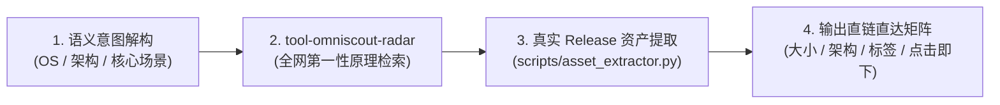

# skill-github-asset-hunter (全网开源资产直达猎手)

本 Skill 是 AI 智能体专属的特种作战指南。当用户提出类似“帮我找个安卓上的 SSH 客户端 APK”、“找个 Windows 开源抓包工具”、“找个 Mac 的剪贴板应用”等软件检索诉求时，**核心目标极其明确：以最快速度为用户交付真实可用的安装包直链。严禁输出空泛套话，严禁越权修改本地工程，必须按照本规范执行标准作业程序 (SOP)**。

---

## 🧭 精准工作链路 (Streamlined Workflow)



### 步骤 1：语义意图与硬件指纹解构 (Intent Decomposition)
* 从用户口语中提取目标操作系统与架构：
  * **Android**：锁定 `.apk`，默认优先匹配 `ARM64-v8a`（95% 现代手机）；
  * **Windows**：锁定 `.exe` / `.msi` / 便携 `.zip`，默认优先匹配 `x64`；
  * **macOS**：锁定 `.dmg` / `.app.zip`，区分 `Apple Silicon (arm64)` 与 `Intel (x86_64)`；
  * **Linux**：锁定 `.AppImage` / 静态单二进制 / `.deb`。

### 步骤 2：调动底层雷达进行正交探测 (Probing)
* 调用 `D:\github\tool-omniscout-radar\main.py radar "<领域与关键词>" --assets`；
* 快速锁定全网具备真实 Release 构建产物的权威开源候选库。

### 步骤 3：真实 Release 资产与下载直链抓取 (Asset Extraction)
* 对判定的标杆项目，执行本 Skill 内置辅助脚本：
  ```bash
  # 批量提取或按报告自动提取
  python D:/github/skill-github-asset-hunter/scripts/asset_extractor.py "<owner/repo1>" "<owner/repo2>"
  python D:/github/skill-github-asset-hunter/scripts/asset_extractor.py --report path/to/radar_report.json --top 3
  ```
* 提取最新正式发版标签（Tag）、发版日期、文件名、文件大小（MB）、官方原链 (`download_url`) 与国内免翻加速镜像 (`mirror_url`)。内置 HTML 网页回退机制，彻底免疫 GitHub API 频控限制。

### 步骤 4：标准化交付矩阵排版 (Delivery Matrix)
* 输出必须满足“四要素”：
  1. **直达性**：必须包含可直接点击开始下载的真实超链接；
  2. **双通道**：同时提供官方 GitHub 源链与国内高带宽加速镜像通道；
  3. **精确性**：标明文件大小与适用的硬件架构（如 ARM64 / Universal），过滤一切无意义的符号映射与调试文件；
  4. **客观性**：附带 Star 数、开源协议与核心定位（为什么选它）。

---

## 📋 交付模板规范 (Output Template)

```markdown
### 1. 软件名 (`owner/repo`) ⭐ Stars
* **核心定位**：一句话说明核心架构机制与不可替代性。
* **最新版本**：`vX.Y.Z` (发布日期: YYYY-MM-DD)
* **直接下载链接**：
  * 🟢 **[针对当前平台的主流包 (推荐)] (XX.X MB)**: [官方直接下载](https://github.com/...) ｜ [国内极速镜像](https://ghfast.top/https://github.com/...)
  * ⚪ **[通用或备用架构包] (XX.X MB)**: [官方直接下载](https://github.com/...) ｜ [国内极速镜像](https://ghfast.top/https://github.com/...)
* **开源协议**：MIT / Apache-2.0 / GPL-3.0
```

---

## 🚫 负向清单约束原则（只限制最不能干的事）

1. **严禁越权修改本地工程与文件**：本技能定位为纯只读检索与资产交付技能，严禁在执行中创建、修改用户项目文件或执行无关的配置注入；
2. **严禁输出死链或推测性链接**：所有下载链接必须经过 `asset_extractor.py` 或 GitHub Releases API 物理核验真实存在；
3. **严禁只给 GitHub 首页**：用户要的是“下载安装”，给一个裸仓库首页推诿给用户自己翻 Releases 是不合格的交付；
4. **严禁推荐已被废弃（Archive）且三年未更新的项目**。

